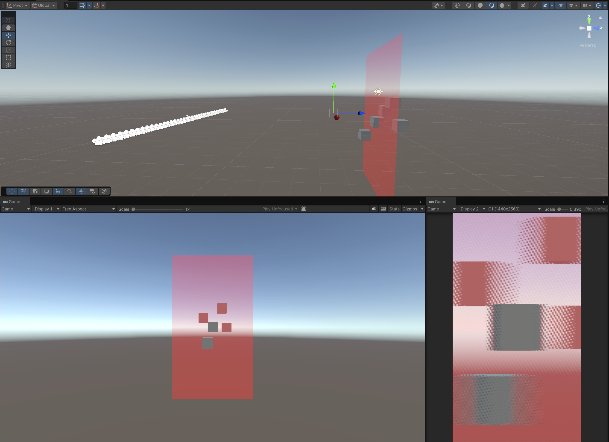
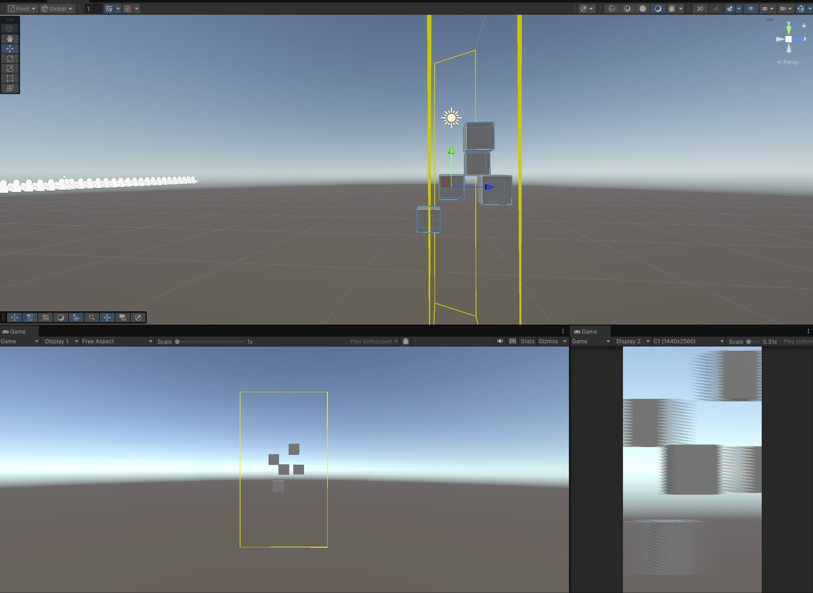
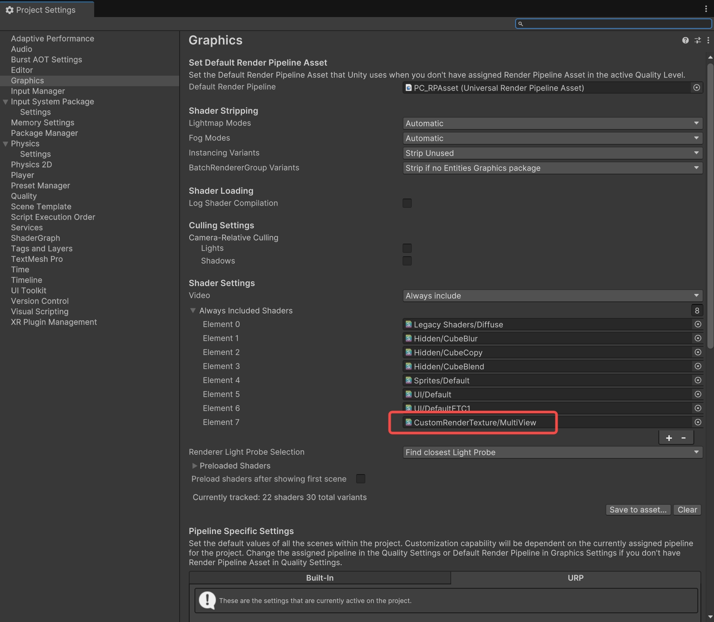

# BatchCameraManager 使用文档

## 简介
`BatchCameraManager` 是一个用于批量管理相机的Unity脚本。它可以根据给定的参数创建和管理一组相机，并将这些相机的渲染结果合并到一个网格纹理中。此外，它还可以显示视锥体框架和焦平面，有助于调试和可视化。

## 1. 版本特点
- 支持自定义相机阵列位置Position、朝向Rotation;
- 支持3种计算原始焦平面方式,用户设定、自动跟随目标、射线检测目标;
- 支持焦平面倍率,相对以上3种计算原始焦平面的方式(特别适用用的场景是:用在锁定目标追焦时,期望沿视线相对被锁定目标做焦平面的移动);
- 支持显示焦平面与建议的最佳观看视锥体,用以协助开发者确认人比较合适的3D内容显示范围;
- 支持使用相机预制体与否,可以通过相机预制体添加后处理特效收;
- 支持设定相机阵列的属性,图层、远近裁剪面;

## 2. 插件安装和使用

### 2.1 添加依赖
确保你的Unity项目已经安装了必要的依赖库，包括但不限于：
- 可以支持Unity 2017及以上版本;
- `System.Security.Cryptography` 用于处理加密解密操作，一般包含在Unity默认环境中;
- `Newtonsoft.Json` 用于解析json数据，可在 Package Manager 中通过名称添加 `com.unity.nuget.newtonsoft-json`;

**示例图片**:

### 2.2 插件导入和脚本添加
1. 插件拖⼊unity项⽬，点击导⼊
2. 将 `BatchCameraManager.cs` 脚本添加到你的Unity项目中(添加在任意物体上)。

### 2.3 参数说明
以下是在Unity编辑器中设置的参数说明：
- **Root (Transform)**: 所有相机和目标物体的父节点，相机阵列将跟随此相机设置的位置Position，朝向Rotation。
- **BatchCameraPrefab (Camera)**: (可选) 如果`useCameraPrefab`设置为true，则使用该预制件来实例化相机。
- **useCameraPrefab (bool)**: 决定是否使用预制件来实例化相机。

- **TargetTransform (Transform)**: 作为焦平面目标的游戏对象的Transform，如果`useTargetFocal`设置为true,此参数不能为空
- **FocalPlane (float)**: 焦平面的距离，范围为0.1到500.0，如果`useTargetFocal`设置为false，可以通过拖拽修改
- **useTargetFocal (bool)**: 决定焦平面是否使用`TargetTransform`的位置。

- **showFocalPlane (bool)**: 决定是否显示焦平面。
- **showFrustumFrame (bool)**: 决定是否显示视锥体框架。

### 2.4 焦平面说明
焦平面是一个虚拟平面，用于确定虚拟相机渲染的焦点位置。当`useTargetFocal`设置为true时，焦平面的距离将根据`TargetTransform`的位置自动调整。当设置为false时，焦平面的距离由`FocalPlane`参数控制。

焦平面是3D显示器上显示最清楚的位置，处于Root和焦平面之间的物体会有“出屏感”，而处于Root到焦平面延长线上的物体则会有入屏感

**示例图片**:

### 2.5 视锥体说明
视锥体框架是相机的视锥体范围的可视化表示，包括近裁剪平面和远裁剪平面。通过设置`showFrustumFrame`为true，可以在场景中显示视锥体框架，方便调试和理解相机的视角范围。

视锥体指示了3D显示器最佳观看的出入屏范围，配合焦平面可以得到一个出屏区域和一个入屏区域，可以方便的调试视觉效果，注意超出该范围的物体在显示器上会有⽐较明显的模糊

**示例图片**:

### 2.6 打包设置
1. 确保所有必要的资源和脚本已添加到项目中。

2. 在Unity编辑器中，选择`Edit` -> `Project Settings` -> `Graphics`，在Always Included Shaders中添加Shader用于交织：`CustomRenderTexture/MultiView`

**示例图片**:

## 3. 问题处理
- 如果遇到相机创建失败，焦平面或视锥体等错误显示，首先检查是否正确设置了`Root`和`TargetTransform`参数,其中Root必须设置，且二者不能相同
- 如果在运行时环境中找不到分辨率为1440x2560的显示器，脚本将禁用自身，请确保目标显示器已正确连接并配置。
