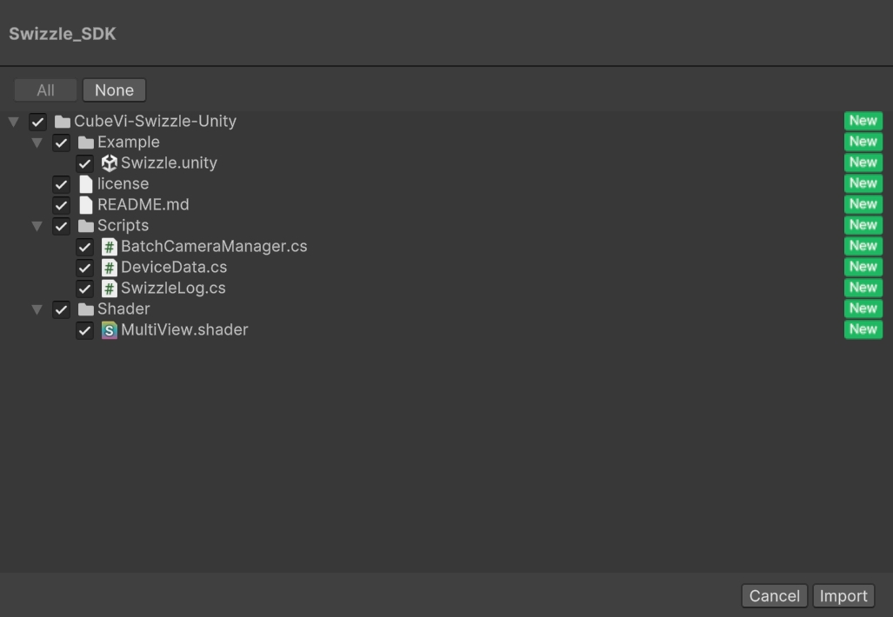
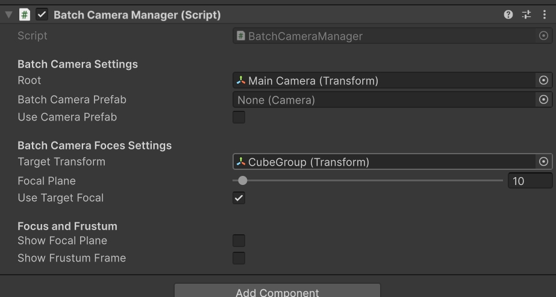

# BatchCameraManager Usage Documentation

## Introduction
`BatchCameraManager` is a Unity script for batch camera management. It can create and manage a group of cameras based on given parameters and merge the rendering results of these cameras into a grid texture. Additionally, it can display frustum frames and focal planes, which helps with debugging and visualization.

## 1. Version Features
- Supports custom camera array position and rotation;
- Supports 3 methods for calculating original focal plane: user-defined, automatic target following, ray detection target;
- Supports focal plane adjustment by multiplier;
- Supports displaying focal plane and recommended optimal viewing frustum to assist developers in determining appropriate 3D content display range;
- Supports using camera prefabs or not, post-processing effects can be added through camera prefabs;
- Supports setting camera array properties, layers, near and far clipping planes;

## 2. Plugin Installation and Usage

### 2.1 Adding Dependencies
Ensure your Unity project has installed the following dependency libraries:
- Supports Unity 2017 and above versions;
- `System.Security.Cryptography` for handling encryption and decryption operations, generally included in Unity's default environment;
- `Newtonsoft.Json` for parsing JSON data, can be added in Package Manager by name `com.unity.nuget.newtonsoft-json`;

### 2.2 Plugin Import and Script Addition
1. Drag the plugin into the Unity project and click import

2. Add the `BatchCameraManager.cs` script to your Unity project (attach to any object).

### 2.3 Parameter Description
The following are parameter descriptions set in the Unity editor:
- **Root (Transform)**: The parent node of all cameras and target objects. The camera array will follow the position and rotation set by this camera.
- **BatchCameraPrefab (Camera)**: (Optional) If `useCameraPrefab` is set to true, this prefab will be used to instantiate cameras.
- **useCameraPrefab (bool)**: Determines whether to use prefabs to instantiate cameras.
- **TargetTransform (Transform)**: The Transform of the game object serving as the focal plane target. This parameter cannot be empty if `useTargetFocal` is set to true.
- **FocalPlane (float)**: The distance of the focal plane, ranging from 0.1 to 500.0. If `useTargetFocal` is set to false, it can be modified by dragging.
- **useTargetFocal (bool)**: Determines whether the focal plane uses the position of `TargetTransform`.
- **showFocalPlane (bool)**: Determines whether to display the focal plane.
- **showFrustumFrame (bool)**: Determines whether to display the frustum frame.

### 2.4 Focal Plane Description
The focal plane is a virtual plane used to determine the focus position for virtual camera rendering. When `useTargetFocal` is set to true, the focal plane distance will automatically adjust based on the position of `TargetTransform`. When set to false, the focal plane distance is controlled by the `FocalPlane` parameter.

The focal plane is the position where the 3D display shows the clearest image. Objects between the Root and focal plane will have a "pop-out" effect, while objects on the extension line from Root to focal plane will have a "pop-in" effect.

**Example Image**:

### 2.5 Frustum Description
The frustum frame is a visual representation of the camera's frustum range, including near and far clipping planes. By setting `showFrustumFrame` to true, the frustum frame can be displayed in the scene, making it convenient for debugging and understanding the camera's viewing angle range.

The frustum indicates the optimal viewing range for pop-out and pop-in effects on the 3D display. Combined with the focal plane, it provides a pop-out area and a pop-in area, making it easy to debug visual effects. Note that objects beyond this range will appear noticeably blurred on the display.

**Example Image**:

### 2.6 Build Settings
1. Ensure all necessary resources and scripts have been added to the project.

2. In the Unity editor, select `Edit` -> `Project Settings` -> `Graphics`, and add the shader for interlacing in Always Included Shaders: `CustomRenderTexture/MultiView`

**Example Image**:

## 3. Troubleshooting
- If you encounter camera creation failures, focal plane or frustum display errors, first check whether the `Root` and `TargetTransform` parameters are correctly set. Root must be set, and the two cannot be the same.
- If a display with resolution 1440x2560 cannot be found in the runtime environment, the script will disable itself. Please ensure the target display is properly connected and configured.